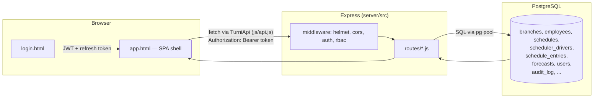
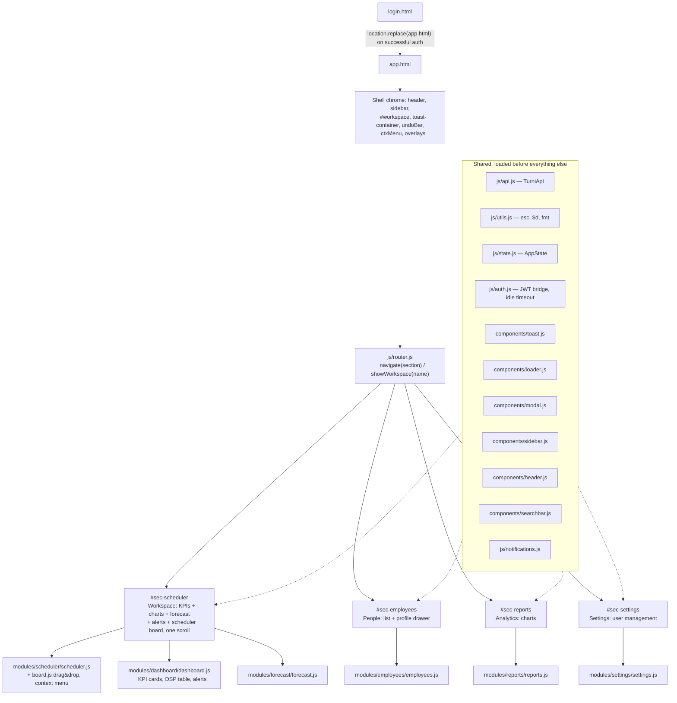
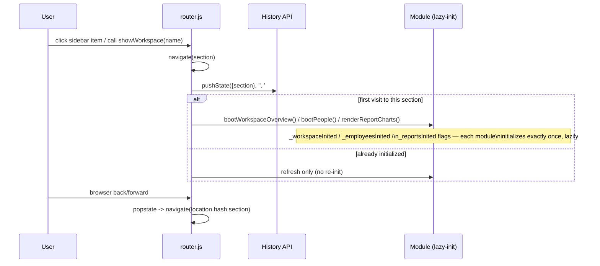
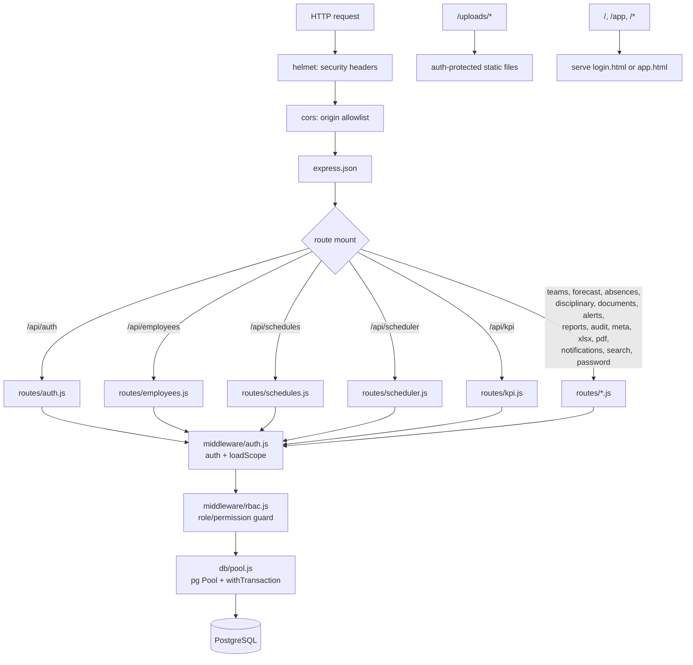
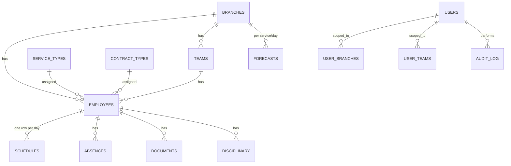

# Architecture — TurniDSP Platform

This document describes how the pieces fit together as they exist today. It
complements `API.md` (endpoint-by-endpoint reference) and `DATABASE.md` (schema
reference) with the higher-level picture: how a request flows from click to
database and back, how the frontend is structured, and how authentication works.

---

## 1. High-level overview



The frontend never talks to PostgreSQL directly — every read/write goes through
`js/api.js` (`TurniApi`), which is the **only** module allowed to call `fetch()`
against the platform's own API. (Two legacy `fetch()` calls exist in
`modules/scheduler/scheduler.js` — `syncPush`/`syncPull` — but those target a
user-configured *external* URL for manual export/import, not the platform API;
they are a separate, optional feature and intentionally out of `TurniApi`'s scope.)

---

## 2. Frontend architecture — true SPA, two HTML files



### Why classic `<script src>` tags, not ES modules

All 20 frontend JS files are loaded as classic scripts sharing one global scope,
**not** ES modules. This is a deliberate choice, not an oversight: `app.html`'s
markup relies on `onclick="fn()"` / `onchange="fn()"` inline handlers throughout
the scheduler board, modals, and forms (40+ call sites). ES modules do not
expose their top-level declarations globally, so converting to
`<script type="module">` would silently break every one of those handlers unless
each handler were also rewired to `addEventListener` — a large, separate,
high-risk change that touches nearly every interactive element in the app and
cannot be safely done without full interactive/visual regression testing.
Load order is dependency order (see the comment block above the `<script>` tags
in `app.html`): shared utilities and the scheduler engine must load **before**
`js/auth.js`, because its auth-bridge IIFE calls `loadMonth()`/`applyRole()`
synchronously at parse time.

### Shared state — `AppState` (`js/state.js`)

`AppState` is a set of **getters**, not a copy of data. Each getter reads the
live variable a module already maintains (`state.schedule`, `_kpiData`,
`_employees`, `USER`, `_currentSection`, …). This means Dashboard and Scheduler
can never disagree — there is exactly one copy of each piece of data, and
`AppState` is just a documented, centralized way to read it:

```js
AppState.currentWorkspace   // -> _currentSection
AppState.scheduler          // -> state (the scheduler engine's live object)
AppState.kpi                // -> _kpiData (same object refreshOverview() writes)
AppState.employees          // -> _employees
AppState.permissions        // -> { platformRole, schedulerRole, isAdmin }
```

After every scheduler save (`saveAll()`), a debounced `refreshOverview()` call
re-reads the same data source the KPI cards use, so the Workspace overview strip
reflects a board edit within about 800ms without a page reload.

---

## 3. SPA routing



Deep links are supported: `#employees/123` opens the People section and, once
the employee list has loaded, that specific profile — this is what the retired
`employees.html#123` bookmarks now resolve to via `navFromUrl()`.

Legacy URLs (`/index.html`, `/dashboard.html`, `/scheduler.html`,
`/employees.html`) no longer exist as files; Express 301-redirects each to
`/app` (see `LEGACY_REDIRECTS` in `server/src/app.js`).

---

## 4. Authentication flow

```mermaid
sequenceDiagram
    participant B as Browser (login.html)
    participant API as POST /api/auth/login
    participant DB as PostgreSQL (users)
    participant A as app.html (TurniApi)

    B->>API: { username, password }
    API->>DB: bcrypt.compare(password, password_hash)
    DB-->>API: user row
    API-->>B: { token (JWT, short TTL), refresh (opaque, 7d), user }
    B->>B: localStorage: turnidsp_token, turnidsp_refresh, turnidsp_user
    B->>A: location.replace('app.html')

    Note over A: every TurniApi call attaches\nAuthorization: Bearer token

    A->>API: any /api/* request
    API-->>A: 401 (token expired)
    A->>API: POST /api/auth/refresh { refresh }
    API->>DB: validate + rotate refresh token
    API-->>A: new { token, refresh }
    A->>API: retries the original request once
    Note over A: if refresh also fails -> redirect to login.html
```



Refresh-token rotation and the retry-once-after-refresh logic already live in
`js/api.js` (`tryRefresh()`), so a session survives an access-token expiry
transparently. RBAC scoping (which branches/teams/services a request can see)
is applied server-side in `middleware/auth.js`'s `loadScope` and enforced again
per-route — the frontend never decides what data it's allowed to see.

---

## 5. Backend architecture



Each route file owns one domain (employees, schedules, forecast, …) and calls
the shared `pool` directly — there is currently no separate
controller/service/repository layering. Route files are already small
(median around 100 lines; the two largest, `scheduler.js` at 644 lines and
`kpi.js` at 458 lines, are large because of genuinely complex domain logic —
`kpi.js` in particular unifies two historically separate data sources, see the
comment block at the top of that file — not because of poor separation).
Introducing a full MVC layering (`controllers/` -> `services/` -> `repositories/`)
across all 24 route files would be a large, invasive change with no automated
test suite to verify against; it has been deliberately left out of this pass to
avoid introducing regressions in a production system. If/when this is
prioritized, the two largest files are the right starting point.

---

## 6. Database structure (summary)

See `DATABASE.md` for the full column-by-column reference. At a glance:



A parallel legacy schema (`scheduler_drivers`, `schedule_entries`,
`schedule_forecasts`) exists from before the platform migration; `kpi.js` reads
a UNION of both systems so the Workspace overview always matches what the
scheduler board shows, regardless of which table a given row actually lives in.

---

## 7. What was intentionally *not* done in this pass

Per the "refactor, don't redesign" constraint and the lack of a browser/test
environment to verify changes against in this session, the following
high-risk, high-effort items from the broader modernization wishlist were
**not** attempted, to avoid shipping unverified regressions to production:

- **ES module conversion** — see section 2 above for why this isn't a safe
  drop-in change.
- **Full backend MVC layering** (routes -> controllers -> services ->
  repositories -> validators) across all 24 route files — see section 5.
- **Rewriting `API.md`/`DATABASE.md` from scratch** — both already exist and
  are broadly accurate; a full audit against every current route was out of
  scope for this pass. Treat them as a starting point, not a guarantee of
  100% coverage of every field added since they were last edited.

These are reasonable follow-ups for a dedicated session with staging/DB access
and the ability to click through the app end-to-end after each change.
